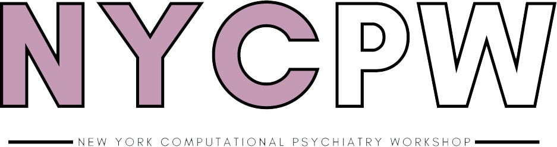

# Website for the New York Computational Psychiatry Workshop

The <b>New York Computational Psychiatry Course</b> (NYCPW) is an immersive, hands-on three-day workshop designed to provide trainees with the latest tools and knowledge in computational psychiatry. Our aim is to bridge the gap between computational methods and clinical applications.